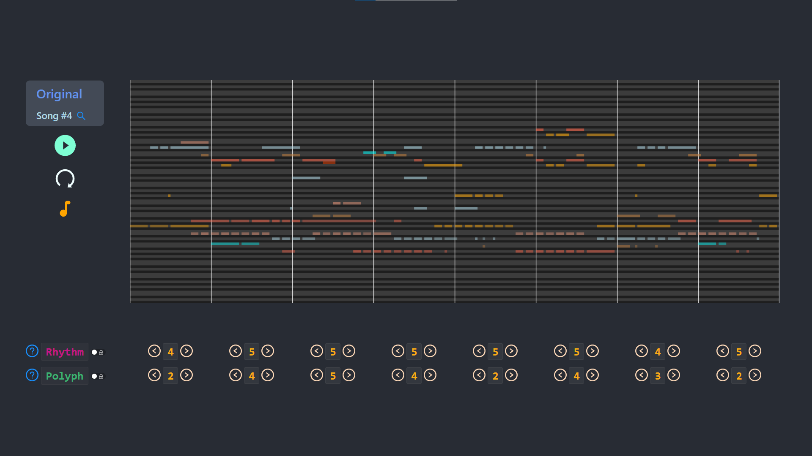
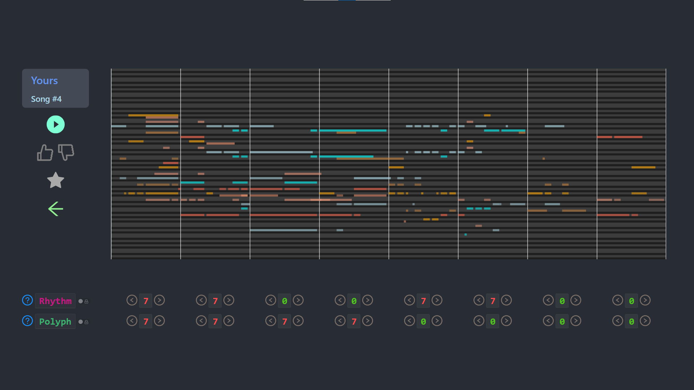
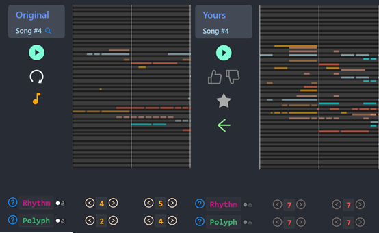
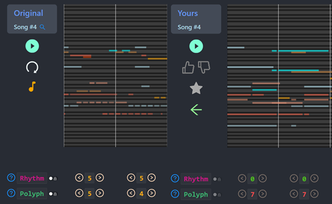
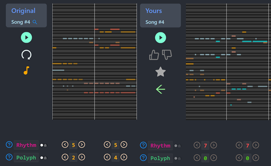
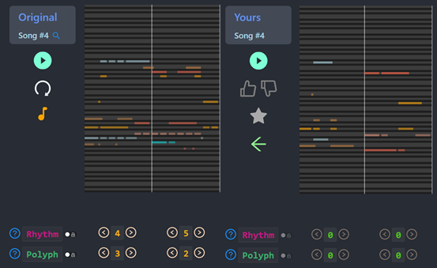

# [109-1] Web Programming Final
### (Group 99) MuseOptimus
#### Deployed at: 維修中
#### Demo 影片: https://www.facebook.com/100002809540176/videos/3060221340748154/
#### 投影片: https://slides.com/slseanwu/museoptimus/fullscreen
#### 使用/操作方式: 點擊連結即可開始

## Project Goal
1. 透過可調旋鈕讓使用者參與 AI 創作音樂的過程
2. 透過評分 & 推薦增加優秀創作的曝光度，
3. 讓使用者瞭解 AI 音樂的潛能，評分結果可作為模型訓練資料的 Crowdsourcing

## How to Bring Up the Services
### Frontend
和一般將 React App 跑起來的流程一樣
```shell
# under project root directory
npm install
npm start
```
### Backend
使用的 Python 版本為 **3.6**
* 安裝 dependencies
```
cd backend
pip3 install -r requirements.txt
```
* 將 `.env` 裡的參數填好
```
WEBAPP_CKPT_PATH=     # path to model checkpoint
WEBAPP_GPUID=         # which GPU to use (e.g., 0, 1, ..., or [empty] to use CPU)
MONGO_URL=            # database URL
```
* 開啟 web server
```
python3 main.py
```
#### 註 1：真實運行的 model 因為保密考量，尚未提供。repo 裡的 model 是一個空殼，只會回傳跟 request 一模一樣的曲子
註 2：`/download` API 預設回傳 MIDI 檔 (請見 `backend/main.py, line 229`), 若要合成 mp3 音檔，需要安裝以下 utilities
* [FluidSynth](https://www.fluidsynth.org/)
* Get the [Soundfont](https://drive.google.com/file/d/17Zqi3CcLcxgkJMRjkinJfBY74MjJhRnx/view?usp=sharing) and place it under `backend/soundfont/`
* [ffmpeg](https://ffmpeg.org/)

## 介紹
  這邊主要介紹此服務對於 AI 創作音樂的可調參數與對應效果。
### 以Song #4作為範例:
  
  可以看到每個小節底下都有兩個參數，分別是控制**節奏緊湊度**的 Rhythm 與 控制**和聲飽滿度**的 Polyph。
  分別會對原曲的該個小節造成不同影響，將其調到各種極端值後可見以下結果。
  
  有些人可能已經感受到這兩個參數的影響了，還看不出效果的話沒有關係，我們進一步看下去。

### 我們將兩張圖放在一起比較會發現:
  第一個小節，可以明顯地看到新的曲子照著原曲的脈絡*長胖了*，也就是一次按下去的音變多了、和聲變得飽和
  
  
   
  第二個小節大致與原曲脈絡一致，但是音符長度變得很長
  
  
   
  第三個小節，音符變得短而急促
  
  
   
  第四個小節，每個音符都形單影隻
  
  

  整個比較下來可以發現，創作出來的歌與原曲脈絡相仿，但隨著 Rhythm(節奏/橫向) 與 Polyph(和聲/縱向) 的調整，歌曲會跟著出現與對應的變化

## 使用工具
### Front end
  1. React  
     -- component 顯示邏輯
  2. HTML5 Canvas  
     -- 動態 pianoroll 繪製
  3. Soundfont Player  
     -- 播放後端以 JSON 傳回的音樂資料
  4. Ant Design  
     -- 排版格式、按鈕、icon
  5. Material-UI  
     -- 部分按鈕、icon
  6. Axios  
     -- request 發送
### Back end
  1. Python3
  2. Flask  
     -- web service
  3. PyTorch  
     -- 運行 AI 作曲 model
  4. miditoolkit  
     -- model 表示法與 midi 音樂格式間轉換
  5. FluidSynth (+midi2audio) & ffmpeg (+pydub)  
     -- 合成音檔、轉檔成 mp3 提供下載
### Database
  1. MongoDB
  2. PyMongo  
     -- 用 python API 對資料庫進行操作

## 分工
- b06902062 陳法熏 
    * 前端設計與實作
    * 報告撰寫
- b06902080 吳士綸 
    * 前端套件找尋、Request API 串接
    * 後端、資料庫實作
    * AI 模型設計與訓練

註：感謝中研院 Music AI Lab 的**張晉睿**同學提供繪製 canvas 的範例 code

## 心得
前端實作的部分，這次深刻體會到有系統地進行的重要性。
首先，雖然知道函式不要寫太大，盡量拆成多個 component 去寫，但是若沒有一定程度的事先規劃或工作分配，
常常會為了方便而直接將相關卻屬於不同功能的 code 寫在同一個檔案，大幅增加後續維護的困難度。

再者便是外觀，一開始雖然知道最好先把主要架構刻出來，
卻因為我們用到了 canvas 這個十分乖張的元素，導致我們希望畫面與裡面的內容可依據視窗大小作調整時，吃了十足的苦頭。
同時，畫面也多次因應各種功能的需求做了排版上的調整，若能事先規劃好可能可以少走許多冤枉路。

如果可以回到當初重頭寫起，可能不需要一半的時間便可以完成，還可以避免寫出一堆很醜的 code ，
但這也說明了這次報告所獲得的，不僅是作品與分數，更多的是那些無法取代也很難從其他管道獲得的寶貴經驗。

後端的部分，則是很高興有這個機會能將 web 技術與正在進行的專題研究結合，
將 AI 藝術創作這個相對小眾的領域推廣給大家。
